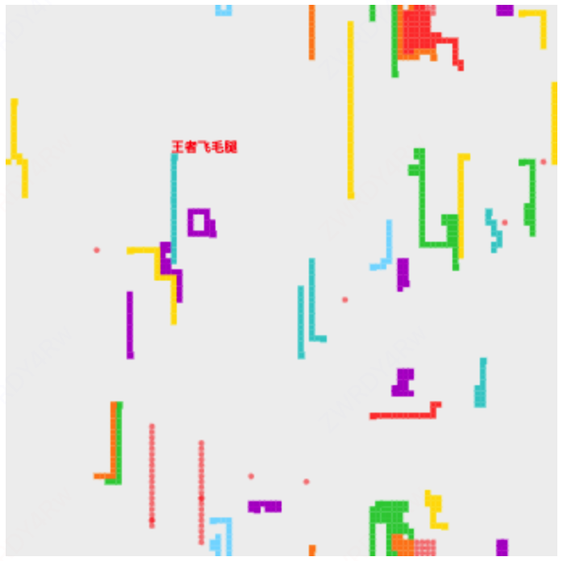

# 多人在线贪吃蛇对战游戏

一个支持多人在线对战的网页版贪吃蛇游戏。玩家可以通过浏览器加入游戏，与其他在线玩家和AI角色进行实时对抗。



## 功能特性

- 多人实时对战
- 智能AI对手
- 实时游戏状态同步
- 碰撞检测系统
- 玩家会话管理

## 技术实现

### 服务端

- 采用Golang开发
- 使用WebSocket实现实时通信
- 服务端负责：
  - 游戏状态计算和同步
  - 角色位置更新
  - 碰撞检测（包括自身碰撞）
  - AI行为控制
  - 玩家会话管理

更多技术细节请参考：[技术文档](doc/tech_readme.md)

### 客户端

- 基于Web技术开发
- 实时渲染游戏画面
- 处理用户输入
- 展示游戏状态和玩家信息

客户端详细说明请参考：[客户端文档](client/README.md)

## 安装说明

1. 克隆仓库
```bash
git clone [repository-url]
cd snakes
```

2. 安装依赖
```bash
go mod download
```

3. 运行服务器
```bash
go run main.go
```

默认情况下，服务器将在 `8080` 端口启动。可以通过 `-port` 参数指定其他端口：
```bash
go run main.go -port 3000
```

## 游戏规则

详细的游戏规则请参考：[游戏规则文档](doc/rule_readme.md)

## AI系统

游戏包含智能AI对手，详细说明请参考：[AI文档](doc/ai_readme.md)

## 开发计划

未来计划添加的功能：

- 玩家认证系统
- 排行榜系统
- 游戏房间
- 自定义游戏配置
- 观战模式

---

# Multiplayer Online Snake Battle Game

A web-based multiplayer snake game that supports online battles. Players can join the game through their browsers to compete in real-time with other online players and AI characters.


## Features

- Multiplayer real-time battles
- Intelligent AI opponents
- Real-time game state synchronization
- Collision detection system
- Player session management

## Technical Implementation

### Server-side

- Developed using Golang
- Real-time communication via WebSocket
- Server responsibilities:
  - Game state calculation and synchronization
  - Character position updates
  - Collision detection (including self-collision)
  - AI behavior control
  - Player session management

For more technical details, please refer to: [Technical Documentation](doc/tech_readme.md)

### Client-side

- Developed using Web technologies
- Real-time game rendering
- User input handling
- Game state and player information display

For detailed client documentation, please refer to: [Client Documentation](client/README.md)

## Installation Guide

1. Clone the repository
```bash
git clone [repository-url]
cd snakes
```

2. Install dependencies
```bash
go mod download
```

3. Run the server
```bash
go run main.go
```

By default, the server will start on port `8080`. You can specify a different port using the `-port` parameter:
```bash
go run main.go -port 3000
```

## Game Rules

For detailed game rules, please refer to: [Game Rules Documentation](doc/rule_readme.md)

## AI System

The game includes intelligent AI opponents. For detailed information, please refer to: [AI Documentation](doc/ai_readme.md)

## Development Roadmap

Planned features for future development:

- Player authentication system
- Leaderboard system
- Game rooms
- Custom game configurations
- Spectator mode

## License

MIT License

Copyright (c) 2024 Snakes

Permission is hereby granted, free of charge, to any person obtaining a copy
of this software and associated documentation files (the "Software"), to deal
in the Software without restriction, including without limitation the rights
to use, copy, modify, merge, publish, distribute, sublicense, and/or sell
copies of the Software, and to permit persons to whom the Software is
furnished to do so, subject to the following conditions:

The above copyright notice and this permission notice shall be included in all
copies or substantial portions of the Software.

THE SOFTWARE IS PROVIDED "AS IS", WITHOUT WARRANTY OF ANY KIND, EXPRESS OR
IMPLIED, INCLUDING BUT NOT LIMITED TO THE WARRANTIES OF MERCHANTABILITY,
FITNESS FOR A PARTICULAR PURPOSE AND NONINFRINGEMENT. IN NO EVENT SHALL THE
AUTHORS OR COPYRIGHT HOLDERS BE LIABLE FOR ANY CLAIM, DAMAGES OR OTHER
LIABILITY, WHETHER IN AN ACTION OF CONTRACT, TORT OR OTHERWISE, ARISING FROM,
OUT OF OR IN CONNECTION WITH THE SOFTWARE OR THE USE OR OTHER DEALINGS IN THE
SOFTWARE.